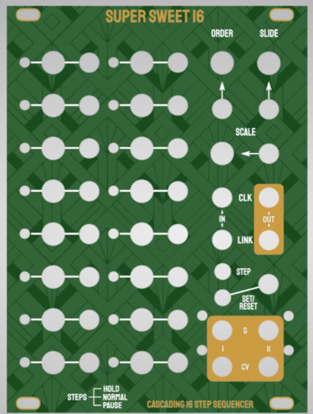

# "Super Sweet 16" - 16 Step Knob-per-function Sequencer Module for Eurorack
For a while now I've been looking for a through hole diy eurorack sequencer that is as hands-on as the Baby8 but with comfort features 
you would maybe not have with an analog/cmos design. The outcome of my struggle is this module. It is a 16-step sequencer with the following functions:
- variable sequence length up to 16 steps
- Cascading (meaning you can connect multiple to get 32/48/etc steps)
- Builtin quantizer with multiple scales (off, chromatic, major, minor, blues, pentatonic)
- 1-5 octave selectable range
- Holding or pausing notes for each steps
- 2 x Gate and 2x CV out
- splittable (meaning you can have 2 channels for sequence lengths lower than 8)
- Slide pot with CV input for held steps
- Internal clock
- Runs Forwards, backwards and randomly selected steps

## Status - Second revision comfirmed working! code needs a bit of cleanup and I need to upload a youtube explaining the use. Also has a version with the SMD package of the MCP4728 now but that one is not tested!

## Hardware and build

I really wanted this to go on one pcb and while its a bit cramped, it works and I think the build is still doable. 
the panel is 19hp, which is kind of a weird size. If people message me about it I might change it to 20 so that there's a bit more space between knobs but for now I'm fine like this.

you need three ICs: 
- An arduino nano v3, 
- a 4067 mux breakout board (like [this](https://www.ebay.de/itm/273816945682), there's a bunch of these any that has this form factor will do.
- A 4728 dac breakout board (slim form factor, like like [this](https://www.play-zone.ch/de/gy-mcp4728-breakout-quad-i2c-dac-mit-eeprom.html). I wanted through hole only and I had a bunch lying around. If these are hard to source for you, look at the smd_dac versions of the circuitboard (should work but have not been verified yet!).

For the build, I would suggest you go in the following order:
1. diodes
2. headers for arduino and breakout boards
3. resistors (this is important because there are resistors across the input jacks that you should definitely do before the jacks)
4. jacks, pots and the rest
Since the board is a bit cramped you might have to think about the order a bit while building, I didn't have major problems but your mileage might vary.

you can order the pcbs as is with the gerbers provided from any pcb service, I use jlc. Make sure to use leadfree surface finish for the panel as you will be touching silver areas.
**I still have a bunch of PCBs and panels leftover, if you're in the EU and don't wanna order yourself I can sell you a set :)**

## Software

code subfolder contains finished arduino sketch. 

for your arduino to compile and upload properly you need the adafruit_4728 library and the Analog-digital-multiplexers library (https://docs.arduino.cc/libraries/analog-digital-multiplexers/).

To make 16 channels and per-step switches work with an arduino nano and one mux on one pcb, I had to cut a few corners.
The result is that if you have cold solder joints or some contacts are not soldered perfectly you might have a bit of MUX crosstalk (meaning that the frequency at which the mux is switched is so high that there is leftover charge from the last reading).
To check, do the following:
- Set the sequencer to a step length smaller than 8 (see operation)
- plug both CV outputs into something you can read or an oscillator so you will notice changes
- Make sure scale pot is turned all the way counterclockwise (no quantization)
- Turn both CV pots of the active step individually and make sure one does not affect the other (only the output of the pot you turn should change). Turn the SLIDE pot and make sure it doesn't affect the output values.

Mine is fine as is but you can increase the CROSSTALK_DELAY_MS variable in the code. this might decrease crosstalk but increase latency. If you still get problems, redo all solder joints. 
If you still get problems after that tell me and we can talk about changing some resistors, but as I said mine works as is so this might not be needed.

## Operation

Basic operation: 
- Plug in clock into clock input. Pots change value from 0-5V, 
switch changes gate behavior:
  - middle position: "on", gate gets triggered on step change and holds until clock input goes low
  - top position: "hold", gate gets triggered and stays on. You can apply slide to the step value
  - bottom position: "off", no gate gets output
- "Scale" pot applies quantization from left to right: none, chromatic, major, minor, melodic minor, blues, pentatonic, fith and octave, octave.
- "Order" Pot changes sequence order. from left to right: forwards, backwards, random (calculated again each time you switch back and forth)
- "Slide" Pot applies slide (slows down cv change) for all steps where "Hold" is on
- "STEP" button goes to next step
- "RESET STEP" button/CV resets the sequence

Menu:
**Press and hold "reset step"** to get into menu mode. Now you can change the following parameters:
- pressing "STEP" button for a short amount of time turns internal clock on and off. CV leds will blink twice quickly to indicate that the clock is switched on/off.
- holdling "STEP" button for more than a second allows you to change internal clock frequency with the "ORDER" pot. and LED will blink indicating the clock speed.
- turning "SLIDE" pot will change sequence length from 2 to 16. Sequences under 8 automatically enable different values for both channels. LEDs indicate new step length
- turning "SCALE" pot will change maximum output voltage between 1 and 5 volts. this will limit the octaves you want to use but allows more detailed tuning in for step values
